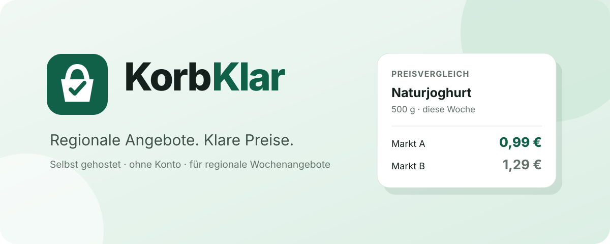

# KorbKlar

<p align="center"></p>

KorbKlar ist ein selbst gehosteter Vergleich für aktuelle regionale Supermarktangebote in Deutschland. Die Anwendung ermittelt Händler anhand der Postleitzahl, normalisiert Packungsgrößen und Grundpreise und zeigt gleiche Angebote vergleichbar an. Bonusprogramme können optional berücksichtigt werden.

**English:** KorbKlar is a self-hosted comparison service for current regional supermarket offers in Germany. It detects retailers from the postal code, normalizes package sizes and unit prices, compares matching offers and can optionally include supported loyalty prices.

## Schnellstart / Quick start

Voraussetzungen: Docker Engine, Docker Compose v2 und Git.

```bash
git clone https://github.com/lesecuritae/KorbKlar.git
cd KorbKlar
docker compose up -d --build
```

Danach ist die Weboberfläche standardmäßig unter `http://SERVER-IP:8000` erreichbar. Ein Konto oder eine LLM ist nicht erforderlich.

The web interface is available on port 8000 by default. No account and no LLM are required.

## Unterstützte Quellen / Supported sources

REWE, EDEKA, Marktkauf, ALDI, Kaufland, Lidl, PENNY, Netto Marken-Discount und GLOBUS. Welche Händler erscheinen, hängt von Region und erreichbaren Quelldaten ab.

## Funktionen / Features

- regionale Suche per deutscher Postleitzahl
- Preis- und Grundpreisvergleich
- Normalisierung alternativer Packungsgrößen
- optionale Bonusprogramme
- Händler- und Produktfilter
- lokaler SQLite-Snapshot-Cache
- lokaler Bildcache mit SSRF-Schutz
- Browseroberfläche plus optionaler REST-Endpunkt
- Docker-Betrieb ohne externe Datenbank

## Betrieb / Operation

Status: `curl http://127.0.0.1:8000/health`

Logs: `docker compose logs -f korbklar`

Stoppen: `docker compose down`

Optionale Einstellungen stehen in [`.env.example`](.env.example). Versionsänderungen und Hinweise zum Umstieg stehen in [`RELEASE_NOTES.md`](RELEASE_NOTES.md).

Optional settings are documented in [`.env.example`](.env.example). Release and migration notes are in [`RELEASE_NOTES.md`](RELEASE_NOTES.md).

## Entwicklung / Development

```bash
python -m venv .venv
. .venv/bin/activate
pip install -e '.[dev]'
pytest -m 'not live'
```

Live-Tests gegen Händlerquellen sind opt-in: `RUN_LIVE_TESTS=1 pytest -m live`.

## Lizenz / License

BSD-3-Clause. Copyright (c) 2026 lesecuritae für Tarnkappe.info.

KorbKlar ist unabhängig und nicht mit den genannten Händlern oder Bonusprogrammen verbunden. Marken- und Produktnamen gehören den jeweiligen Rechteinhabern.
